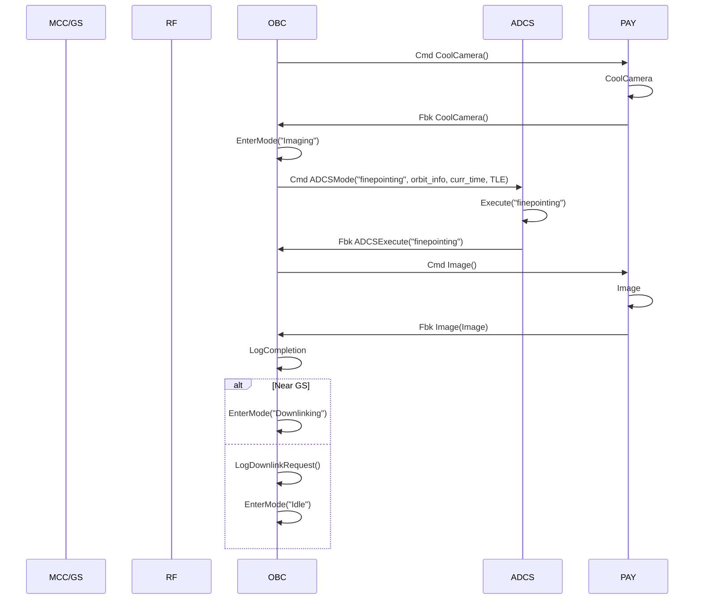

# Imaging Command Sequence

```mermaid
sequenceDiagram
    participant MCC/GS
    participant RF
    participant OBC
    participant ADCS
    participant PAY

        OBC ->> PAY: Cmd CoolCamera()
        PAY ->> PAY: CoolCamera
        PAY ->> OBC: Fbk CoolCamera()
        OBC ->> OBC: EnterMode("Imaging")
        OBC ->> ADCS: Cmd ADCSMode("finepointing", orbit_info, curr_time, TLE)
        ADCS ->> ADCS: Execute("finepointing")
        ADCS ->> OBC: Fbk ADCSExecute("finepointing")
        OBC ->> PAY: Cmd Image()
        PAY ->> PAY: Image
        PAY ->> OBC: Fbk Image(Image)
        OBC ->> OBC: LogCompletion

        alt Near GS
            OBC ->> OBC: EnterMode("Downlinking")
        else
            OBC ->> OBC: LogDownlinkRequest()
            OBC ->> OBC: EnterMode("Idle")
            end
```
