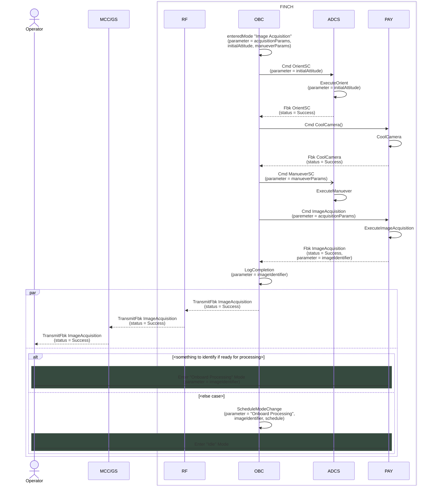

# Image Acquisition Command Sequence

```mermaid
sequenceDiagram
    Actor Operator
    participant MCC/GS
    box FINCH
        participant RF
        participant OBC
        participant ADCS
        participant PAY
    end

    OBC ->> OBC: enteredMode "Image Acquisition" <br> (parameter = acquisitionParams, <br> initialAttitude, manueverParams)

        OBC ->> ADCS: Cmd OrientSC <br> (parameter = initialAttitude)
        ADCS ->> ADCS: ExecuteOrient <br> (parameter = initialAttitude)
        ADCS -->> OBC: Fbk OrientSC <br> (status = Success)
        OBC ->> PAY: Cmd CoolCamera()
        PAY ->> PAY: CoolCamera

        PAY -->> OBC: Fbk CoolCamera <br> (status = Success)

        OBC -) ADCS: Cmd ManueverSC <br> (parameter = manueverParams)
        ADCS ->> ADCS: ExecuteManuever
        OBC ->> PAY: Cmd ImageAcquisition <br> (paremeter = acquisitionParams)
        PAY ->> PAY: ExecuteImageAcquisition
        PAY -->> OBC: Fbk ImageAcquisition <br> (status = Success, <br> parameter = imageIdentifier)
        OBC ->> OBC: LogCompletion <br> (parameter = imageIdentifier)

        par
            OBC -->> RF: TransmitFbk ImageAcquisition <br> (status = Success)
            RF -->> MCC/GS: TransmitFbk ImageAcquisition <br> (status = Success)
            MCC/GS -->> Operator: TransmitFbk ImageAcquisition <br> (status = Success)
        and

            alt <something to identify if ready for processing>
                rect rgb(54,74,63)
                    Operator -> PAY: Enter "Onboard Processing" Mode <br> (parameter = imageIdentifier)
                end
            else <else case>
                OBC ->> OBC: ScheduleModeChange <br> (parameter = "Onboard Processing", <br> imageIdentifier, schedule)
                rect rgb(54,74,63)
                    Operator -> PAY: Enter "Idle" Mode
                end
            end
        end

```
