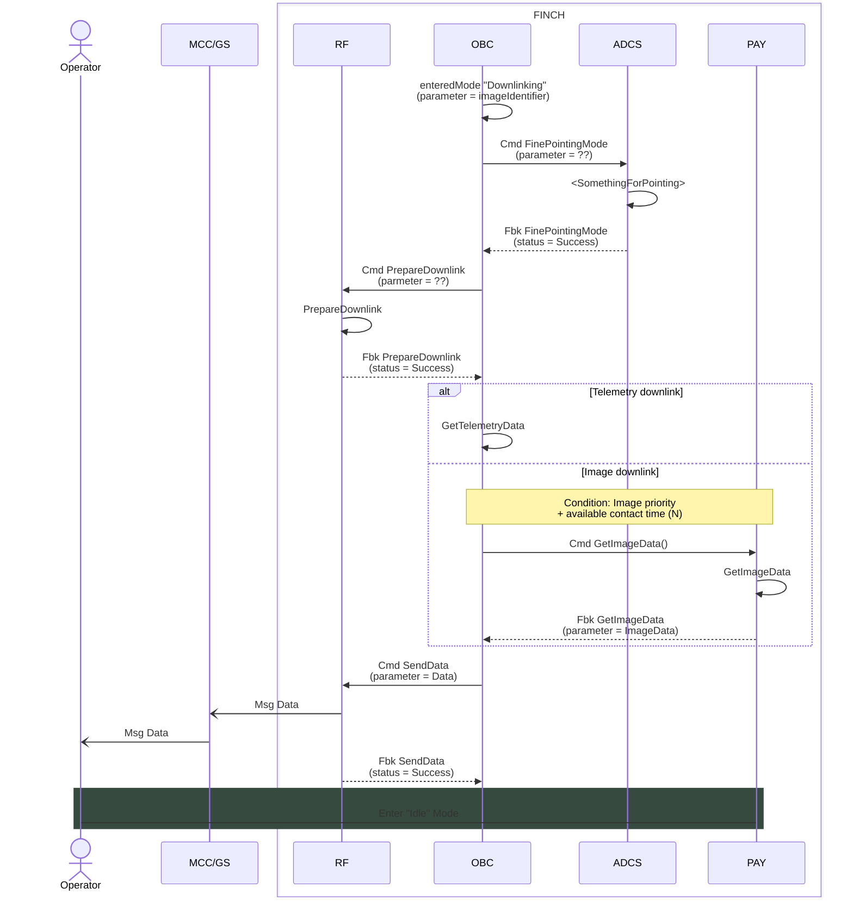

# Downlinking Command Sequence

```mermaid

sequenceDiagram

    actor Operator
    participant MCC/GS
    box FINCH
        participant RF
        participant OBC
        participant ADCS
        participant PAY
    end

    OBC ->> OBC: enteredMode "Downlinking" <br> (parameter = imageIdentifier)

    OBC ->> ADCS: Cmd FinePointingMode <br> (parameter = ??)
    ADCS ->> ADCS: <SomethingForPointing>
    ADCS -->> OBC: Fbk FinePointingMode <br> (status = Success)

    OBC ->> RF: Cmd PrepareDownlink <br> (parmeter = ??)
    RF ->> RF: PrepareDownlink
    RF -->> OBC: Fbk PrepareDownlink <br> (status = Success)

    alt Telemetry downlink
        OBC ->> OBC: GetTelemetryData
    else Image downlink
        note over OBC,PAY: Condition: Image priority <br> + available contact time (N)
        OBC ->> PAY: Cmd GetImageData()
        PAY ->> PAY: GetImageData
        PAY -->> OBC: Fbk GetImageData <br> (parameter = ImageData)
    end

    OBC ->> RF: Cmd SendData <br> (parameter = Data)
    RF -) MCC/GS: Msg Data

    MCC/GS -) Operator: Msg Data
    RF -->> OBC: Fbk SendData <br> (status = Success)

    rect rgb(54,74,63)
		Operator -> PAY: Enter "Idle" Mode
	end

```
