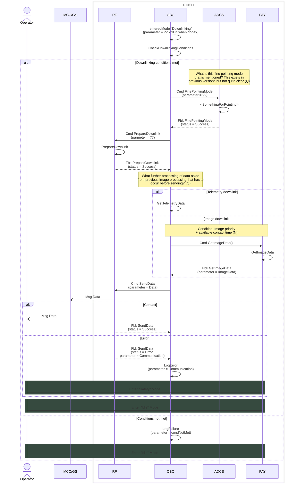

# Downlinking Command Sequence

```mermaid

sequenceDiagram

    actor Operator
    participant MCC/GS
    box FINCH
        participant RF
        participant OBC
        participant ADCS
        participant PAY
    end

    OBC ->> OBC: enteredMode "Downlinking" <br> (parameter = ?? <fill in when done>)
    OBC ->> OBC: CheckDownlinkingConditions

    alt Downlinking conditions met
        note over ADCS: What is this fine pointing mode <br> that is mentioned? This exists in <br> previous versions but not quite clear (Q)
        OBC ->> ADCS: Cmd FinePointingMode <br> (parameter = ??)
        ADCS ->> ADCS: <SomethingForPointing>
        ADCS -->> OBC: Fbk FinePointingMode <br> (status = Success)

        OBC ->> RF: Cmd PrepareDownlink <br> (parmeter = ??)
        RF ->> RF: PrepareDownlink
        RF -->> OBC: Fbk PrepareDownlink <br> (status = Success)

        note over OBC: What further processing of data aside <br> from previous image processing that has to <br> occur before sending?  (Q)
        alt Telemetry downlink
            OBC ->> OBC: GetTelemetryData
        else Image downlink
            note over OBC,PAY: Condition: Image priority <br> + available contact time (N)
            OBC ->> PAY: Cmd GetImageData()
            PAY ->> PAY: GetImageData
            PAY -->> OBC: Fbk GetImageData <br> (parameter = ImageData)
        end

        OBC ->> RF: Cmd SendData <br> (parameter = Data)
        RF -) MCC/GS: Msg Data
        alt Contact
            MCC/GS -) Operator: Msg Data
            RF -->> OBC: Fbk SendData <br> (status = Success)
        else Error
            RF -->> OBC: Fbk SendData <br> (status = Error, <br> parameter = Communication)
            OBC ->> OBC: LogError <br> (parameter = Communication)
            rect rgb(54,74,63)
                Operator -> PAY: Enter "Safety" Mode
            end
        end

        rect rgb(54,74,63)
	        Operator -> PAY: Enter "Idle" Mode
        end
    else Conditions not met
        OBC ->> OBC: LogFailure <br> (parameter = condNotMet)
        rect rgb(54,74,63)
	        Operator -> PAY: Enter "Idle" Mode
        end
    end

```
