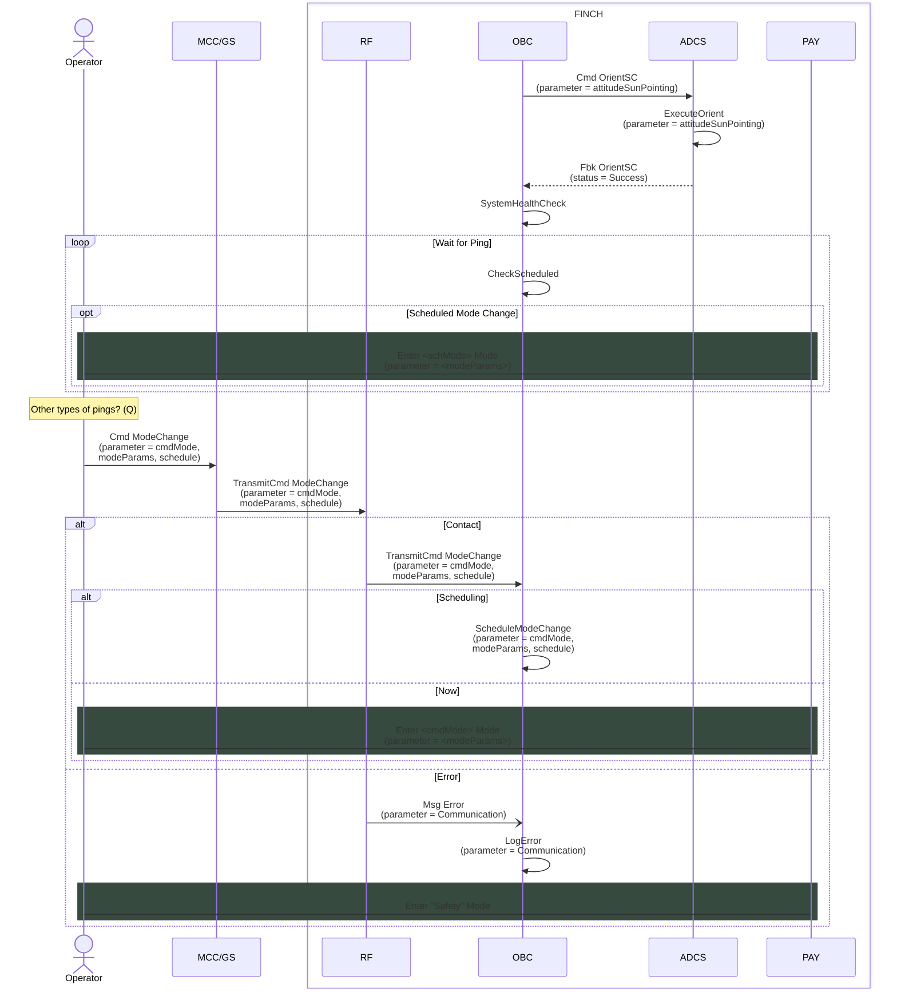

# Idle Command Sequence

```mermaid
sequenceDiagram
    actor Operator
    participant MCC/GS
    box FINCH
        participant RF
        participant OBC 
        participant ADCS
        participant PAY
    end

    OBC ->> ADCS: Cmd OrientSC <br> (parameter = attitudeSunPointing)
    ADCS ->> ADCS: ExecuteOrient <br> (parameter = attitudeSunPointing)
    ADCS -->> OBC: Fbk OrientSC <br> (status = Success)
    OBC ->> OBC: SystemHealthCheck

    loop Wait for Ping
        OBC ->> OBC: CheckScheduled
        opt Scheduled Mode Change
            rect rgb(54,74,63)
              	Operator -> PAY: Enter <schMode> Mode <br> (parameter = <modeParams>)
            end
        end
    end

    note over Operator: Other types of pings? (Q)
    Operator ->> MCC/GS: Cmd ModeChange <br> (parameter = cmdMode, <br> modeParams, schedule)
    MCC/GS ->> RF: TransmitCmd ModeChange <br> (parameter = cmdMode, <br> modeParams, schedule)
    alt Contact
        RF ->> OBC: TransmitCmd ModeChange <br> (parameter = cmdMode, <br> modeParams, schedule)
        alt Scheduling
            OBC ->> OBC: ScheduleModeChange <br> (parameter = cmdMode, <br> modeParams, schedule)
        else Now
            rect rgb(54,74,63)
                Operator -> PAY: Enter <cmdMode> Mode <br> (parameter = <modeParams>)
            end
        end
    else Error
        RF -) OBC: Msg Error <br> (parameter = Communication)
        OBC ->> OBC: LogError <br> (parameter = Communication)
        rect rgb(54,74,63)
            Operator -> PAY: Enter "Safety" Mode
        end
    end

```
