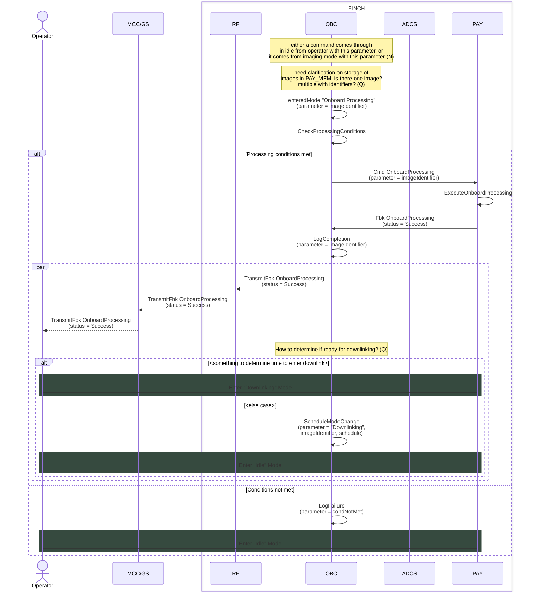

# Onboard Processing Command Sequence

```mermaid

sequenceDiagram
    Actor Operator
    participant MCC/GS
    box FINCH
        participant RF
        participant OBC
        participant ADCS
        participant PAY
    end

	note over OBC: either a command comes through <br> in idle from operator with this parameter, or <br> it comes from imaging mode with this parameter (N)
	note over OBC: need clarification on storage of <br> images in PAY_MEM, is there one image? <br> multiple with identifiers? (Q)
	OBC ->> OBC: enteredMode "Onboard Processing" <br> (parameter = imageIdentifier)

    OBC ->> OBC: CheckProcessingConditions
    alt Processing conditions met
        OBC ->> PAY: Cmd OnboardProcessing <br> (parameter = imageIdentifier)
        PAY ->> PAY: ExecuteOnboardProcessing
        PAY ->> OBC: Fbk OnboardProcessing <br> (status = Success)
		OBC ->> OBC: LogCompletion <br> (parameter = imageIdentifier)
      
        par
            OBC -->> RF: TransmitFbk OnboardProcessing <br> (status = Success)
            RF -->> MCC/GS: TransmitFbk OnboardProcessing <br> (status = Success)
            MCC/GS -->> Operator: TransmitFbk OnboardProcessing <br> (status = Success)
        and
			note over OBC: How to determine if ready for downlinking? (Q)
			alt <something to determine time to enter downlink>
				rect rgb(54,74,63)
      	      		Operator -> PAY: Enter "Downlinking" Mode
            	end
			else <else case>
				OBC ->> OBC: ScheduleModeChange <br> (parameter = "Downlinking", <br> imageIdentifier, schedule)
	    		rect rgb(54,74,63)
      	     	  	Operator -> PAY: Enter "Idle" Mode
           	 	end
			end
		end
    else Conditions not met
		OBC ->> OBC: LogFailure <br> (parameter = condNotMet)
        rect rgb(54,74,63)
	        Operator -> PAY: Enter "Idle" Mode
        end
    end
```
