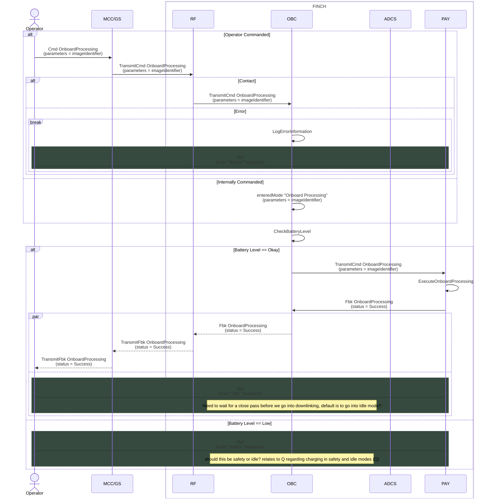

# Onboard Processing Command Sequence

```mermaid

sequenceDiagram
    Actor Operator
    participant MCC/GS
    box FINCH
        participant RF
        participant OBC
        participant ADCS
        participant PAY
    end

    alt Operator Commanded
        Operator ->> MCC/GS: Cmd OnboardProcessing <br> (parameters = imageIdentifier)
        MCC/GS ->> RF: TransmitCmd OnboardProcessing <br> (parameters = imageIdentifier)
        alt Contact
            RF ->> OBC: TransmitCmd OnboardProcessing <br> (parameters = imageIdentifier)
        else Error
            break
                OBC ->> OBC: LogErrorInformation
                rect rgb(54,74,63)
    		        Operator -> PAY: Ref <br/> Enter "Safety" Sequence
                end
            end
        end
    else Internally Commanded
        OBC ->> OBC: enteredMode "Onboard Processing" <br> (parameters = imageIdentifier)
    end

    OBC ->> OBC: CheckBatteryLevel
    alt Battery Level == Okay
        OBC ->> PAY: TransmitCmd OnboardProcessing <br> (parameters = imageIdentifier)
        PAY ->> PAY: ExecuteOnboardProcessing
        PAY ->> OBC: Fbk OnboardProcessing <br> (status = Success)
      
        par
            OBC -->> RF: Fbk OnboardProcessing <br> (status = Success)
            RF -->> MCC/GS: TransmitFbk OnboardProcessing <br> (status = Success)
            MCC/GS -->> Operator: TransmitFbk OnboardProcessing <br> (status = Success)
        and
            rect rgb(54,74,63)
      	        Operator -> PAY: Ref <br/> Enter "Idle" Sequence
                note over OBC: Need to wait for a close pass before we go into downlinking, default is to go into Idle mode?
            end
        end
    else Battery Level ==  Low
        rect rgb(54,74,63)
	        Operator -> PAY: Ref <br/> Enter "Safety" Sequence
            note over OBC: should this be safety or idle? relates to Q regarding charging in safety and idle modes (Q)
        end
    end
```
