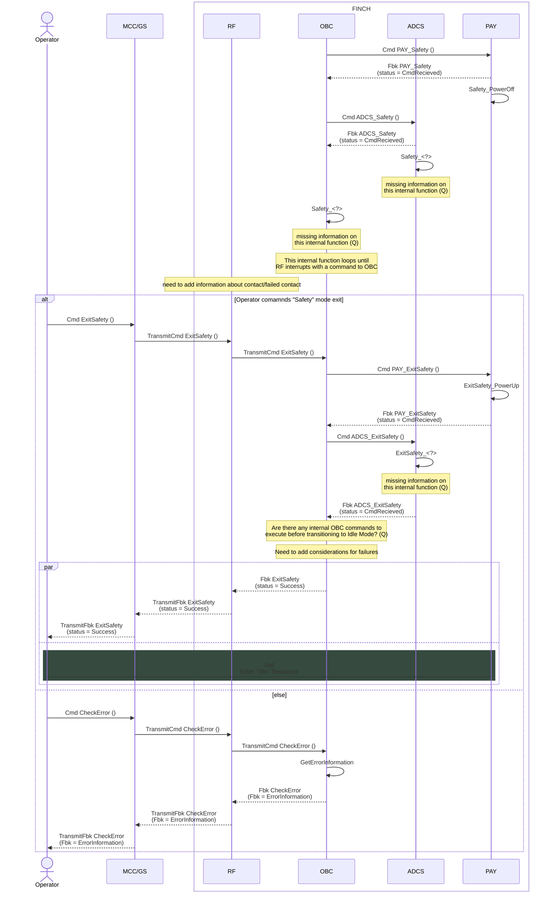

# Safety Command Sequence 

```mermaid
sequenceDiagram
    Actor Operator
    participant MCC/GS
    box FINCH
	participant RF
    	participant OBC
    	participant ADCS
    	participant PAY
	end

    OBC ->> PAY: Cmd PAY_Safety ()
    PAY -->> OBC: Fbk PAY_Safety <br> (status = CmdRecieved)
    PAY ->> PAY: Safety_PowerOff
  
    OBC ->> ADCS: Cmd ADCS_Safety ()
    ADCS -->> OBC: Fbk ADCS_Safety <br> (status = CmdRecieved)
    ADCS ->> ADCS: Safety_<?>
    note over ADCS: missing information on <br> this internal function (Q)


    OBC ->> OBC: Safety_<?>
    note over OBC: missing information on <br> this internal function (Q)
    note over OBC: This internal function loops until <br> RF interrupts with a command to OBC
	
	note over RF: need to add information about contact/failed contact
	alt Operator comamnds "Safety" mode exit
        Operator ->> MCC/GS: Cmd ExitSafety ()
	MCC/GS ->> RF: TransmitCmd ExitSafety ()
	RF ->> OBC: TransmitCmd ExitSafety ()

        OBC ->> PAY: Cmd PAY_ExitSafety ()
        PAY ->> PAY: ExitSafety_PowerUp
        PAY -->> OBC: Fbk PAY_ExitSafety <br> (status = CmdRecieved)
  
        OBC ->> ADCS: Cmd ADCS_ExitSafety ()
        ADCS ->> ADCS: ExitSafety_<?>
        note over ADCS: missing information on <br> this internal function (Q)
        ADCS -->> OBC: Fbk ADCS_ExitSafety <br> (status = CmdRecieved)

		note over OBC: Are there any internal OBC commands to <br> execute before transitioning to Idle Mode? (Q)
		note over OBC: Need to add considerations for failures

		par
			OBC -->> RF: Fbk ExitSafety <br> (status = Success)
			RF -->> MCC/GS: TransmitFbk ExitSafety <br> (status = Success)
			MCC/GS -->> Operator: TransmitFbk ExitSafety <br> (status = Success)
		and
			rect rgb(54,74,63)
				Operator -> PAY: Ref <br/> Enter "Idle" Sequence
			end
		end
	else else
		Operator ->> MCC/GS: Cmd CheckError ()
		MCC/GS ->> RF: TransmitCmd CheckError ()
		RF ->> OBC: TransmitCmd CheckError ()
		OBC ->> OBC: GetErrorInformation
		OBC -->> RF: Fbk CheckError <br> (Fbk = ErrorInformation)
		RF -->> MCC/GS: TransmitFbk CheckError <br> (Fbk = ErrorInformation)
		MCC/GS -->> Operator: TransmitFbk CheckError <br> (Fbk = ErrorInformation)
	end
```
