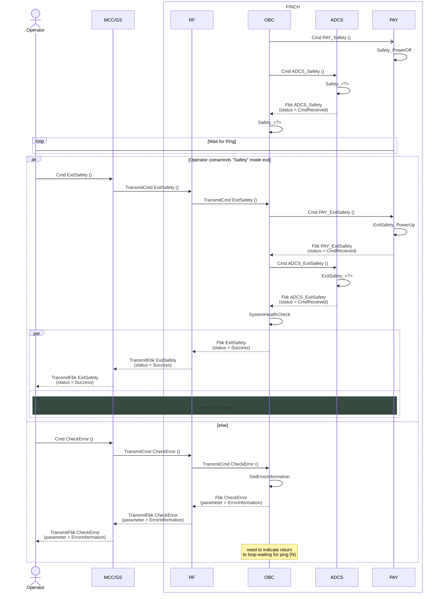

# Safety Command Sequence 

```mermaid
sequenceDiagram
    Actor Operator
    participant MCC/GS
    box FINCH
	participant RF
    	participant OBC
    	participant ADCS
    	participant PAY
	end

    OBC -) PAY: Cmd PAY_Safety ()
    PAY ->> PAY: Safety_PowerOff
  
    OBC ->> ADCS: Cmd ADCS_Safety ()
    ADCS ->> ADCS: Safety_<?>
    ADCS -->> OBC: Fbk ADCS_Safety <br> (status = CmdRecieved)


    OBC ->> OBC: Safety_<?>

    loop Wait for Ping
        Operator -> PAY: 
    end
	
	alt Operator comamnds "Safety" mode exit
		Operator ->> MCC/GS: Cmd ExitSafety ()
		MCC/GS ->> RF: TransmitCmd ExitSafety ()
		RF ->> OBC: TransmitCmd ExitSafety ()

 	   OBC ->> PAY: Cmd PAY_ExitSafety ()
	    PAY ->> PAY: ExitSafety_PowerUp
	    PAY -->> OBC: Fbk PAY_ExitSafety <br> (status = CmdRecieved)
  
 	   OBC ->> ADCS: Cmd ADCS_ExitSafety ()
	    ADCS ->> ADCS: ExitSafety_<?>
	    ADCS -->> OBC: Fbk ADCS_ExitSafety <br> (status = CmdRecieved)

		OBC ->> OBC: SystemHealthCheck

		par
			OBC -->> RF: Fbk ExitSafety <br> (status = Success)
			RF -->> MCC/GS: TransmitFbk ExitSafety <br> (status = Success)
			MCC/GS -->> Operator: TransmitFbk ExitSafety <br> (status = Success)
		and
			rect rgb(54,74,63)
				Operator -> PAY: Enter "Idle" Mode
			end
		end
	else else
		Operator ->> MCC/GS: Cmd CheckError ()
		MCC/GS ->> RF: TransmitCmd CheckError ()
		RF ->> OBC: TransmitCmd CheckError ()
		OBC ->> OBC: GetErrorInformation
		OBC -->> RF: Fbk CheckError <br> (parameter = ErrorInformation)
		RF -->> MCC/GS: TransmitFbk CheckError <br> (parameter = ErrorInformation)
		MCC/GS -->> Operator: TransmitFbk CheckError <br> (parameter = ErrorInformation)
		note over OBC: need to indicate return <br> to loop waiting for ping (N)
	end
```
